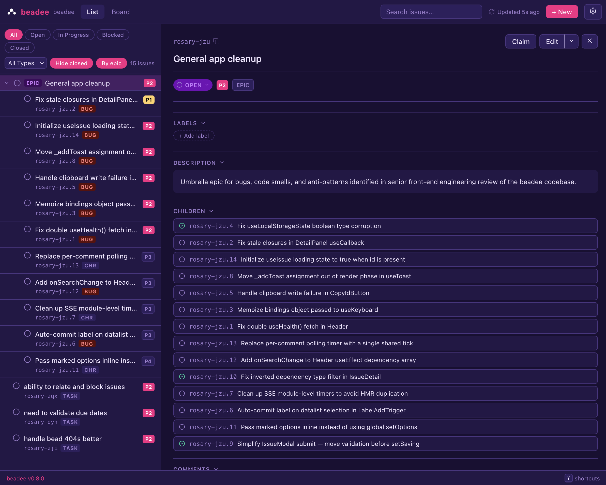

<div align="center">
    <h1>beadee</h1>
    <p>A web GUI for the <a href="https://github.com/gastownhall/beads">beads</a> issue tracker.</p>
</div>

<div align="center">
<a href="https://www.npmjs.com/package/@mrkrstphr/beadee">
</a>
<a href="LICENSE"></a>
</div>

## Features

- **List & Board views** — switch between a filterable list with a detail pane and a Kanban board
- **Full CRUD** — create, edit, claim, and close issues without leaving the browser
- **Rich filtering** — filter by status, type, priority, or full-text search
- **Issue detail pane** — inline view of description, labels, children, and comments
- **Real-time updates** — changes made via `bd` CLI reflect instantly via SSE
- **Themes** — dark (default), light, dracula, synthwave, hacker, and auto

<br />



## Requirements

- Node.js 22+
- `bd`installed and in your `PATH`

## Installation

```bash
npm install -g @mrkrstphr/beadee
```

## Usage

Run from a directory that contains a beads project (`.beads/`):

```bash
beadee
```

Or:

```bash
npx @mrkrstphr/beadee --open
```

### Options

```
-p, --port <n>   Port to listen on (default: OS picks a free port)
-H, --host <h>   Host to bind to (default: 127.0.0.1)
-o, --open       Open browser automatically after start
-v, --version    Print version and exit
-h, --help       Show this help
```

## License

MIT
